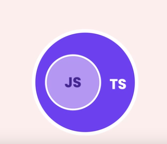
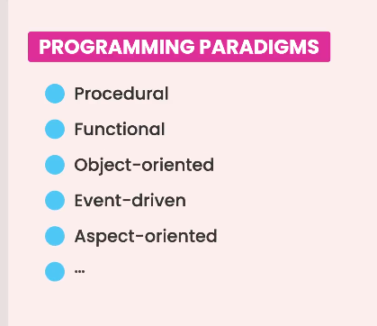
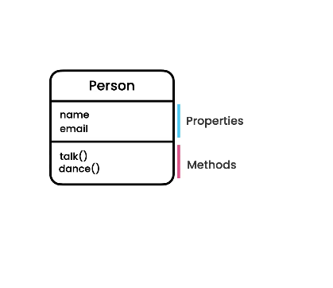

# TypeScript Course Reference ✈️


# section 1  intoduction to type script 🥈
## 1.what is typescript ?
 - typescript is a programing language build on the top of javascript 

## 2. benifites 🍱
1. static typing 
 any programming language eaither statically typing or dynamically typing the type of vaiables is detected throw compile time 
 statically-typed : C++ c# Java
 dynamically-typed the type of variables is detected throw run time and can be changed js is example of this type of programming languages 
- ** typescript is just javascript with type Checking **
for example if we create vraiable of type number and assign to it number the compiler will stop us at compile time  
- install type script compiler 
<!-- {npm i -g typescript}  -->
2. code completion


3.  refactoring
4. shorthand notations
# section 2 .Fundametals 
## 1. Built-in types 
    1.javascript has this built-in types 
     number string bollean null undefined object 
    2. typescript extend this list and introduce this types 
     any unknown never enum tuple 
## 2. any type 
  - the any type represent variable that can take any type 
## 3. arrays   
 we define array exaclty like java script and annotaed it with its type let example : let mumbers:number[] =[1,2,3]
 ## 4. tuples 
   key , value pairs 
   let user:[number,string]=[1,"ali"]

   let user:[number , string]=[1,"ali"]
   console.log(user[0].toFixed())

 ## 5.  enums
    it represent a list of related constants 
    ex : enum Sizes{
    Small,Medieum,Large=12
}
console.log(Sizes.Large)
 ## 6. functions   
 ### - example 
 ``` typescript
function CalculateTax(income:number=12):number | undefined{
    let x=0;
    if ((income || 2022) < 50_000){
        return income* 45 + x;
    }
    // return income * 1.2 ;

}

let x = CalculateTax();
console.log(x)
```
we can detect the type of returned type of the function if we dont detect it it can return any thing 
we can make parameters optional by mark the parameter using ? oprerator in this situation any block in the function will face the error to of be the parameter undefinned we solve it by pass to it default value or by usinh this methof (ParaValue || 2022 )
    
## 7. objects 
### - example 1
``` typescript
   let employee:{
    id:number,
    name?:string
} = {id:1}
employee.name="12";  
### - example 2
let employee:{
  readonly  id:number,
    name?:string,
    retire : (date:Date)=> void
} = {id:1,retire:(date:Date)=>{
    console.log(date)
}}
employee.name="12";
employee.retire(new Date())
```

### - detials 
 this how we define object in java script 
   let obj ={}
   and we cann add any new key,value pair to it during runtime but this is not supported in type script we need to detect the shape of the option durng define it so in the previous exaple we add type annotaion to the object :{id:number , name:string} we add ? to name annotaion to make it optional some time we dont need to make the changing of object propertiy possible so that we use readonly modifier so when we try to change the id of the employee we will get this error Cannot assign to 'id' because it is a read-only property.ts(2540)
# section 3 : Advanced Types 
  - type aliases
  - Unions and intersections
  - type narrowing 
  - nullable types 
  - the unknown type
  - the never type 
## 1. Type Aliases
    DRY principale mean Dont Repeat your Self 
    when we crate the employee obect in the last section we creat object to annotate the shape of th object 
    `:{id:number,name?:string,retire:(date:Date)=>void}`
    when we need to create new object we will repeate this section 
    using type aliases we can define custom type 
## example : 
  
      ```typescript
   type Employee = {
  readonly  id:number,
    name?:string,
    retire : (date:Date)=> void
}
let employee: Employee= {id:1,retire:(date:Date)=>{
    console.log(date)
}}
    employee.name="12";
   employee.retire(new Date())
   ```

## 2. Union Type 
 using union type we can give function or variable more than one type
 example  
function KgtoLbs(weight : number | string ):number {

  // when we try acces weight functions we cant acces string options or numbers options we see only common methods between string and number so we use 
  // narrowing so we will narrow down this union type to more specific type 
  if(typeof weight ==='number'){
   return  parseInt(weight.toFixed());
  }else{
  return  parseInt(weight.length.toString());
  }

}


KgtoLbs(10);
KgtoLbs("10 KG")
## 3. intersections
  let weight: number & string ;
// this represent an object which in the same time is number and string 
// this relaistic is possible 

type Draggable ={
  drag : ()=> void 
}
type ReSizable ={
resize:()=>void
}

type UiWidget = Draggable & ReSizable;
let textbox:UiWidget={
  drag:()=>{},
  resize:()=>{}

}
## 4. Literal types 
let quantity:100 | 20= 1001
console.log(quantity) 
here we can assign only 100 or 20 to quantity 

her after restructure the code 

type Quantity =100 | 20
let quantity:Quantity = 100
console.log(quantity)
## 5. Nullable Types 
example 
function greet (name:string|null
){
  // here name id truthy not null and not undefined 
  if (name ) console.log('hello {$name}')
  else console.log("null or undefined name")
}

greet("null");
## 6. optional Chaning
  type Customer={
  birthdate :Date
}

function getCustomer(id:number ):Customer | null{
  return id === 0 ? null : {
    birthdate:new Date()
  } 
}
let customer=getCustomer(0);
console.log(customer.birthdate)
in this code customer possible be null so we cant access the birthdate with this method so we need to chechk before acces the birthdate 
if(customer != null && customer !== undefined)
console.log(customer.birthdate)
we can replace this condeition with 
optional property access operator ?.
optional element access operator ?.[]
optional call operator ?.()
type Customer={
  birthdate? :Date
}

function getCustomer(id:number ):Customer | null | undefined{
  return id === 0 ? null : {
    birthdate:new Date()
  } 
}
let customer=getCustomer(0);

// ?. optional property access opertor

// if(customer != null && customer !== undefined)
console.log(customer?.birthdate?.getFullYear())
// ?.[]  optional element access operator 
// console.log(array?.[0])
// optional call operator 
let log :any =(a:string)=>{
  console.log(a)
}
log?.();
## 7. Nullish coaelscing operator 
let speed : number | null =null;
let ride = {
  <!-- speed: speed != null ? speed : 30 -->
  speed : speed?? 30
}
this code we can simple it using Nullis coaelscing operator ??

## 8.Type Assertions 
   sometime we know more the type of object than type script example of type assertions 
   let phone =document.getElementById('phone') as HTMLInputElement

```typescript 
console.log(phone.value)

let phone = <HTMLInputElement>document.getElementById('phone') ;

console.log(phone?.value)
```
// this functon return either null or HTMLElement
//  Document.getElementById(elementId: string): HTMLElement | null
// HTMLElement : is a class defined in java script represent any kind of html element
//  it is parent class for sub classed like HTMLIputElement
// HTMLIputElement this class conatin property called value to read the value written by the user 
// but type script donot know this so we use type assertion to access the value of phone 

## 9. the unknowm type

 ## example 
   // the unknown Type 
function render (document : any ){
  document.move();
  document.run();

}

here in this function the parametere document can called for any function name even if this name is not exist in this situation we are telling ts compiler to shut up 
so we use unknown type to avoid this shut up of comiler and use type narowing to check document type then the compiler know  the type of the documnet in every if block and handle it correcty 
// the unknown Type 
function render (document : unknown ){

if (typeof document ==='string'){
  document.charAt(0);
}
  document.move();
  document.run();

}

## 10.the  never type 

the never type represent value that never occurs 
example : 
// we annoutaed this function with never to tell the compiler this function will never return 
function processEvents():never{
    while (true){
        console.log("processing")
    }
}

function reject(message:string):never{
    throw new Error(message)
}
processEvents();
reject("kkkkkk");
// this line will never executed 
console.log("hello word ")

# section 4 : object-oriented programming
** what we will lean ?? **
 1. intoduction to oop 
 2. classes 
 3. constructors 
 4. properties and methods 
 5. accesss control keywords 
 6. getters and setters 
 7. static members 
 8. index signatures 
 9. inheritance 
 10. polymorphism
 11. abstract classes 
 12. interfaces 

 ## 1. what is oop(object-oriented programming ) ? 
   oop is one of many programming styles like 
   

   js and ts support functional programming and object oriented programming 
   objects are the building blocks of our application 

   example of object 
   
  object conatin  properties and methods ( any function inside class or object called method)
## 2. classes
   ** creating Classes **
   A class is a blueprint for creating objects 
   we can define class in typescript and we can use it to create objects
    we use pascal name convention for class name so that we capitalize the first letter of each word in the class name
 


```typescript 
   class Account{
    id : number;
    name : string;
    balance : number;

    constructor(id:number,name:string,balance:number){
        this.id=id;
        this.name=name;
        this.balance=balance;
    }

    // any function create inside class we call it method 
    deposit(amount:number):void{
        if (amount <= 0){
            throw new Error("amount must be greater than zero")
        }else{
        this.balance +=amount;

        }
    }   
    
  }
  // using the new operator to create an object from the class
    let account =new Account(1,"ali",1000);
    account.deposit(500);

   console.log(account instanceof Account)
  console.log(account)
  
  //  creatin opjects
  // using the new operator we can create instance of existing class 
  let account =new Account(1,"ali",1000);
  account.deposit(500);

    console.log(account)
  ```

## 3. Read-Only and Optional Properties 
   * exmple *
   in the previous examlle we can change the id of the user in any lcaton of our programm and this may lead to bug in our program to solve this problem we use the ** readonly modifier ** now we can only chage the id inside the constructor 

   if we need add optional propertie we can use ? operator 
   like this 
   `nickName?:string ;`

## 4. Access Control Keywords :
   1. public : 
      any defined properties and functions is bydefault public we can access it from anywhere 
   2. private 
      we can access it inside the class only 
   3. protected 
      we can access it inside the class and and other class extend this class which contain this protected properties 

    ```typescript

      class Account {

    // we cant change this property we can only init it fron constructor
      readonly id:number ;
      owner: string ;
    // 
      private _balance: number ;
      nickname?:string
    
      constructor(id:number,owner:string,balance:number){
        this.id=id;
        this.owner=owner;
        this._balance=balance;
    }
    deposite(amount : number){
        if (amount <= 0){
            throw new Error("amount must be greater than zero")
        }
        this._balance +=amount;
    }
    get balance(){
        return this._balance
    }
     }

    let account = new Account(1,"ali",1000);
       account.deposite(122)
        console.log(account.balance)
      ```


## 5. Parameter Properties 
   ###### idea 
         when we create class with peoperties we create the propertis detect it level visisbility using readonly private protected and public then we init in iside the constructor this behaviour is so repetitve the better way is in the example
  ###### example 
       ``` typescript 
       class Account {

    // we cant change this property we can only init it fron constructor
//    readonly id:number ;
    // owner: string ;
    // 
    // private _balance: number ;
    nickname?:string
    
    constructor(public readonly id:number,public owner:string,private _balance:number){
        // this.id=id;
        // this.owner=owner;
        // this._balance=balance;
    }
    deposite(amount : number){
        if (amount <= 0){
            throw new Error("amount must be greater than zero")
        }
        this._balance +=amount;
    }
    get balance(){
        return this._balance
    }
}

let account = new Account(1,"ali",1000);
account.deposite(122)
console.log(account.balance)

       ```       
## 6. getters and setters 

   ### example 
   ```typescript
       get balance(){
        return this._balance
    }
    set balance(value:number){
        if (value < 0){
            throw new Error("balance cannot be negative")
        }
        this._balance=value;
    }
   ```
## 7. classes
## 8. classes
## 9. classes
## 10. classes
## 11. classes
## 12. classes
