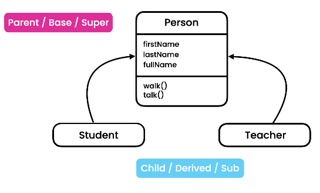

# ✈️ TypeScript Mastery Course Reference

Welcome to my personal TypeScript reference guide. This repository serves as a comprehensive cheatsheet and memory jogger for TypeScript development, covering everything from basic types to Advanced Object-Oriented Programming (OOP).

👤 **Author:** [Ali Salhab (ali-salhab)](https://github.com/ali-salhab)
📅 **Status:** In Progress / Learning Journey

---

## 🥈 Section 1: Introduction to TypeScript

### 1. What is TypeScript?
TypeScript is a strongly typed programming language built on top of JavaScript. It acts as a **syntax sugar** and a **compiler** that adds a static type-checking layer to your development workflow.

### 2. Key Benefits 🍱
*   **Static Typing:** 
    *   **Statically-typed** languages (e.g., C++, C#, Java) detect variable types at **compile-time**.
    *   **Dynamically-typed** languages (e.g., JavaScript) detect types at **runtime**, allowing variables to change types dynamically.
    *   > **Core Concept:** TypeScript is just JavaScript with **compile-time type checking**. If you assign a string to a `number` variable, the compiler will catch the error before production.
*   **IntelliSense & Code Completion:** Get instant suggestions, method documentation, and autocomplete inside your IDE.
*   **Safe Refactoring:** Rename variables or change function signatures globally without breaking the app blindly.
*   **Shorthand Notations:** Clean, modern syntax that reduces boilerplate code.

#### Installation
To install the TypeScript compiler globally on your machine:
```bash
npm i -g typescript

```

---

## 📦 Section 2: Fundamentals

### 1. Built-in Types

* **JavaScript primitives:** `number`, `string`, `boolean`, `null`, `undefined`, `object`.
* **TypeScript additions:** `any`, `unknown`, `never`, `enum`, `tuple`.

### 2. The `any` Type

Represents any type of value. It completely shuts down the type checker. **Avoid using it** as it defeats the purpose of TypeScript.

### 3. Arrays

Defined just like JavaScript arrays, but annotated with a specific type to restrict elements.

```typescript
let numbers: number[] = [1, 2, 3];

```

### 4. Tuples

A fixed-length array where each element has a **known, fixed type**. Ideal for Key-Value pairs.

```typescript
let user: [number, string] = [1, "ali"];
console.log(user[0].toFixed()); // Valid

```

### 5. Enums

Represents a list of related, human-readable constants. By default, values start from 0.

```typescript
enum Sizes { Small = 1, Medium, Large = 12 }
console.log(Sizes.Large); // Outputs: 12

```

### 6. Functions

Functions can have strongly typed parameters, default values, optional parameters (`?`), and explicit return types.

```typescript
function calculateTax(income: number = 50_000): number {
    if (income < 50_000) {
        return income * 0.15;
    }
    return income * 0.2;
}

let tax = calculateTax();
console.log(tax);

```

### 7. Objects

In JavaScript, objects are dynamic (you can add properties anytime). In TypeScript, the **shape** of the object must be declared during definition. You can use `?` for optional properties and `readonly` to prevent modifications.

```typescript
let employee: {
    readonly id: number,
    name?: string,
    retire: (date: Date) => void
} = {
    id: 1,
    retire: (date: Date) => {
        console.log(date);
    }
};

employee.name = "Ali"; // Valid
// employee.id = 2; // Error: Cannot assign to 'id' because it is a read-only property.

```

---

## 🚀 Section 3: Advanced Types

### 1. Type Aliases

Follows the **DRY (Don't Repeat Yourself)** principle. Instead of rewriting object shapes repeatedly, define a custom layout alias.

```typescript
type Employee = {
    readonly id: number;
    name: string;
    retire: (date: Date) => void;
};

let newEmployee: Employee = {
    id: 2,
    name: "Omar",
    retire: (date) => console.log(date)
};

```

### 2. Union Types & Narrowing

Unions allow a variable or parameter to accept more than one type using the `|` operator. We use **Type Narrowing** to check the runtime type before accessing type-specific methods.

```typescript
function kgToLbs(weight: number | string): number {
    // Narrowing
    if (typeof weight === 'number') {
        return weight * 2.2;
    } else {
        return parseInt(weight) * 2.2;
    }
}

```

### 3. Intersection Types

Combines multiple types using the `&` operator. An object must fulfill all combined type rules.

```typescript
type Draggable = { drag: () => void };
type Resizable = { resize: () => void };

type UIWidget = Draggable & Resizable;

let textBox: UIWidget = {
    drag: () => {},
    resize: () => {}
};

```

### 4. Literal Types

Restricts a variable to an **exact set of explicit values** (not just a generic type like number or string).

```typescript
type Quantity = 20 | 100;
let quantity: Quantity = 100; // Can only be 20 or 100

```

### 5. Nullable Types

By default, TypeScript is strict about `null` and `undefined`. Use union types to safely handle optional or missing data.

```typescript
function greet(name: string | null | undefined) {
    if (name) console.log(`Hello ${name}`);
    else console.log("Guest User");
}

```

### 6. Optional Chaining (`?.`)

Provides a clean syntax to access properties, array elements, or call methods safely when an intermediate value might be `null` or `undefined`.

```typescript
type Customer = { birthdate?: Date };

function getCustomer(id: number): Customer | null {
    return id === 0 ? null : { birthdate: new Date() };
}

let customer = getCustomer(0);
// Optional property access
console.log(customer?.birthdate?.getFullYear()); 

```

### 7. Nullish Coalescing Operator (`??`)

Fallback operator that returns the right-side operand **only** if the left-side operand is `null` or `undefined` (unlike `||`, it treats `0` or `""` as valid values).

```typescript
let speed: number | null = null;
let ride = {
    speed: speed ?? 30 // Fallback to 30 because speed is null
};

```

### 8. Type Assertions

Used when you (the developer) know more about the type of an object than TypeScript does. It does not perform any runtime casting.

```typescript
// Using 'as' keyword
let phone = document.getElementById('phone') as HTMLInputElement;
console.log(phone.value);

// Using angle-bracket syntax (Alternative)
let email = <HTMLInputElement>document.getElementById('email');

```

### 9. The `unknown` Type

A type-safe alternative to `any`. It tells the compiler that the value could be anything, but **forces** you to perform type checking (narrowing) before executing methods on it.

```typescript
function render(document: unknown) {
    if (typeof document === 'string') {
        console.log(document.toUpperCase()); // Safe
    }
    // document.move(); // Error: Object is of type 'unknown'
}

```

### 10. The `never` Type

Represents values that **never occur**. Typically used for functions that throw exceptions continuously or run an infinite execution loop.

```typescript
function reject(message: string): never {
    throw new Error(message);
}

function processEvents(): never {
    while (true) {
        // Infinite loop
    }
}

```

---

## 🏛️ Section 4: Object-Oriented Programming (OOP)

### 1. What is OOP?

Object-Oriented Programming is a paradigm centered around **Objects** containing data (properties) and logic/functions (methods). JavaScript and TypeScript natively support both OOP and Functional Programming styles.

### 2. Classes & Objects

A class is a blueprint, and an object is an instance created from that blueprint using the `new` keyword.

```typescript
class Account {
    id: number;
    owner: string;
    balance: number;

    constructor(id: number, owner: string, balance: number) {
        this.id = id;
        this.owner = owner;
        this.balance = balance;
    }

    deposit(amount: number): void {
        if (amount <= 0) throw new Error("Amount must be greater than zero.");
        this.balance += amount;
    }
}

let account = new Account(1, "Ali", 1000);
account.deposit(500);
console.log(account instanceof Account); // true

```

### 3. Access Control Keywords

Controls the visibility of class members (properties and methods):

* `public` (Default): Accessible from anywhere.
* `private`: Accessible only inside the declaring class.
* `protected`: Accessible inside the declaring class and its subclasses.

### 4. Parameter Properties (Shorthand Syntax)

TypeScript offers a shorthand to declare properties and initialize them directly from the constructor parameters.

```typescript
class SmartAccount {
    // Shorthand syntax automatically initializes fields
    constructor(
        public readonly id: number, 
        public owner: string, 
        private _balance: number
    ) {}
}

```

### 5. Getters and Setters

Used to access or mutate private fields safely while adding custom validation logic.

```typescript
class BankAccount {
    constructor(private _balance: number) {}

    get balance(): number {
        return this._balance;
    }

    set balance(value: number) {
        if (value < 0) throw new Error("Balance cannot be negative.");
        this._balance = value;
    }
}

```

### 6. Static Members

Properties or methods that belong to the **Class itself**, rather than any specific instantiated object.
```typescript
// static members in class
class Ride {
    static activeRides:number = 0;

static start(){
    this.activeRides++;
}
static stop(){
    this.activeRides--;
}

}

Ride.start();
Ride.start();
console.log(Ride.activeRides)

```
```typescript
class Circle {
    static pi = 3.14;
    static calculateArea(radius: number): number {
        return this.pi * radius * radius;
    }
}
console.log(Circle.pi); // 3.14 (Accessed without 'new' keyword)

```

### 7. Index Signatures

Used when you need to dynamically create object properties but don't know the property names beforehand.

```typescript
class SeatAssignment {
    // Index signature: key is a string, value is a string (e.g., A1: "Ali")
    [seatNumber: string]: string;
}

let room = new SeatAssignment();
room.A1 = "Ali";
room.A2 = "Omar";

```

### 8. Inheritance

The ability to reuse code by creating a new class (subclass) based on an existing class (parent class) using the `extends` keyword.

```typescript
class Person {
    constructor(public firstName: string, public lastName: string) {}
    get fullName() { return `${this.firstName} ${this.lastName}`; }
}

class Student extends Person {
    constructor(public studentId: number, firstName: string, lastName: string) {
        super(firstName, lastName); // Calls parent constructor
    }
}

```
```typescript
// inheritance
// parent/Base/super class 
class Person{
    constructor(public firstName:string,public lastName:string){

    }
 get fullName(){
    return this.firstName + " " + this.lastName;
 }

 walk ()
{
    console.log("walking")
}
}

// child/derived/sub class
class Student extends Person{
    constructor(firstName:string,lastName:string,public studentId:number){
        // here we call the constructor of the parent class to initialize the firstName and lastName properties
    super(firstName,lastName)
    }
}

let student = new Student("ali","mohamed",11232);
console.log(student.fullName)
student.walk()

```

### 9. Polymorphism

"Many forms". Allows subclasses to provide their own specific implementation of a method that is already defined in their parent class (Method Overriding).

```typescript
class Teacher extends Person {
    override get fullName() {
        return `Professor ${super.fullName}`;
    }
}

```

### 10. Abstract Classes & Methods

An abstract class acts strictly as a blueprint and **cannot be instantiated** with `new`. Abstract methods inside it have no implementation body and **must** be implemented by subclasses.

```typescript
abstract class Shape {
    abstract render(): void;
}

class Square extends Shape {
    override render(): void { console.log("Rendering a square..."); }
}

```

### 11. Method Overriding 
   


### 12. Interfaces


Interfaces define the exact **contract/shape** of an object or class without any implementation logic. Classes implement interfaces using the `implements` keyword.

```typescript
interface Calendar {
    name: string;
    addEvent(): void;
}

class GoogleCalendar implements Calendar {
    constructor(public name: string) {}
    addEvent(): void { console.log("Event added."); }
}

```

```